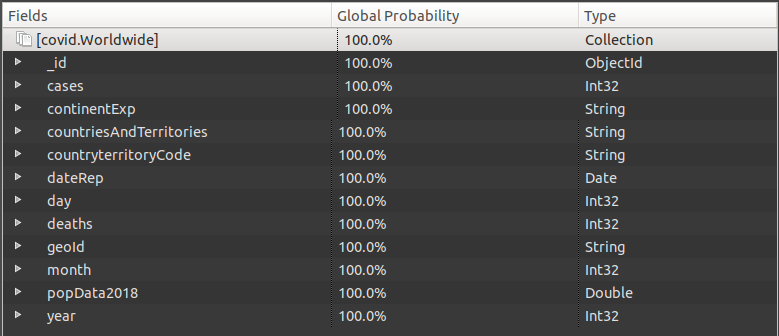
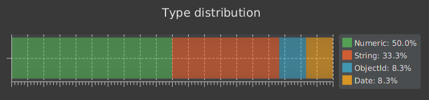
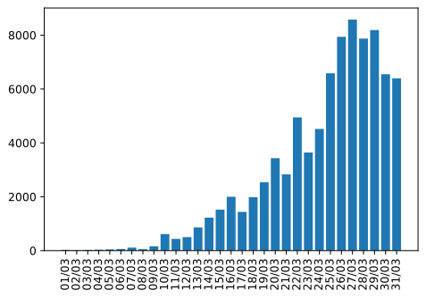
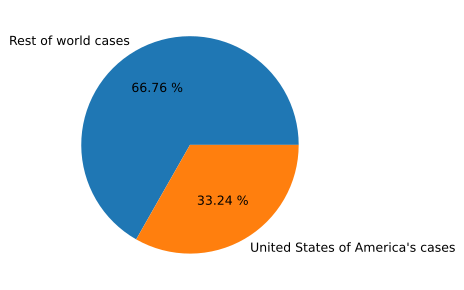

# Big Data
Este proyecto tratará sobre la creación de una aplicación big data, para la cual se realizará un estudio sobre el efecto del coronavirus (COVID-19)
en el mundo. Para ello se usará las diversas técnicas utilizadas para el tratamiento masivo de información. Como: Big Data, MongoDB, Azure Cosmos DB, Jupiter Notebook, etc.

## Tipos de datos
Los tipos de datos que forman parte de nuestra Base de Datos se encuentran en un conjunto formando lo que en las bases de datos *no relacionales*, se entiende como *colección* de datos, en nuestro caso está formado por los siguientes:  



* ### Distribución de los tipos de datos
Se puede observar como  el tipo numérico el predominante con cinco elementos del documento de este tipo, seguido del tipo cadena con cuatro elementos y el formato fecha con un elemento.  



## Ejemplos de consulta realizados
A continuación, se mostrarán algunos tipos de consulta que se han realizado en el proyecto, junto con su resultado de la consulta.   
Estas consultas se han llevado a cabo en *Jupyter Notebook* (haciendo uso de lenguaje *Python*).

* ### Casos en España confirmados en el mes de Marzo
```
1 data = client .get_data_country(’Spain’)
2 month = 3
3 cases = []
4 dates = []
56
# Get data
7 for d in data:
8 date = d[’dateRep’]
9 if date.month == month:
10 cases.append(abs(d[’cases’]))
11 dates.append(date.strftime("%d/%m"))
12
13 # Reverse data
14 cases = cases [::−1]
15 dates = dates [::−1]
16 y_pos = np.arange(len(dates))
17 plt .bar(y_pos, cases)
18 plt . xticks (y_pos, dates, rotation = 90)
19 plt .show()
```
En este caso, el resultado de la consulta sería el siguinte  diagrama de barras recaudando dicha información.


* ### Porcentaje de casos en Estados Unidos respecto al resto del mundo
````
1 country = "United_States_of_America"
2 country_cases = client .get_total_cases_country(country)
3 total_cases = client . get_total_cases () − country_cases 45
values = [ total_cases , country_cases]
6 names = ["Rest of world cases", (country.replace("_"," ") + " ’s cases")]
7 plt .pie(values, labels=names, autopct=" %0.2f %%")
8 plt .show()
````
En esta consulta, el resultado de la consulta sería la siguiente distribución de tipo '*pastel*' recaudando dicha información.



